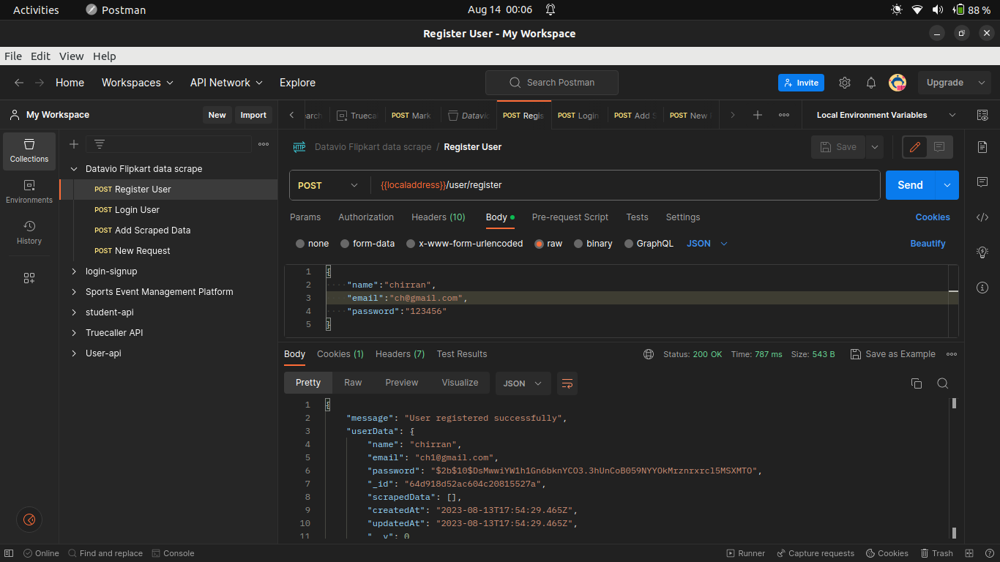
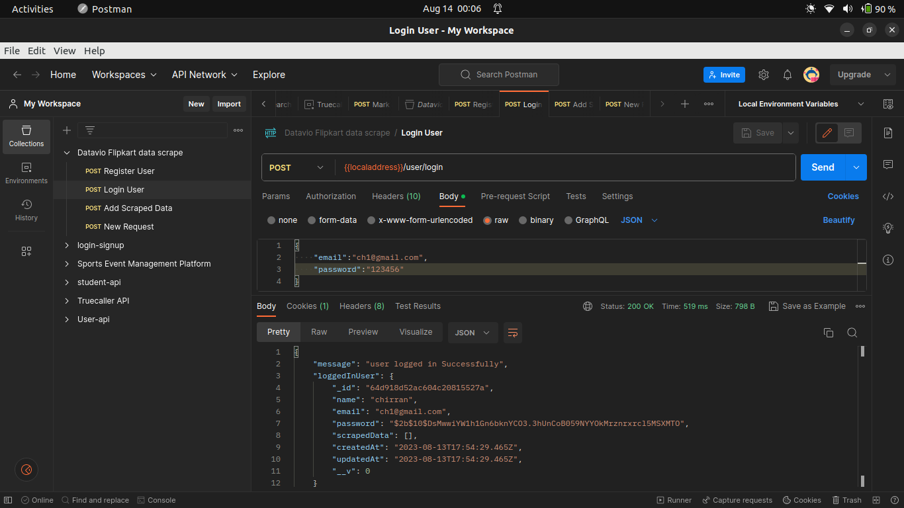
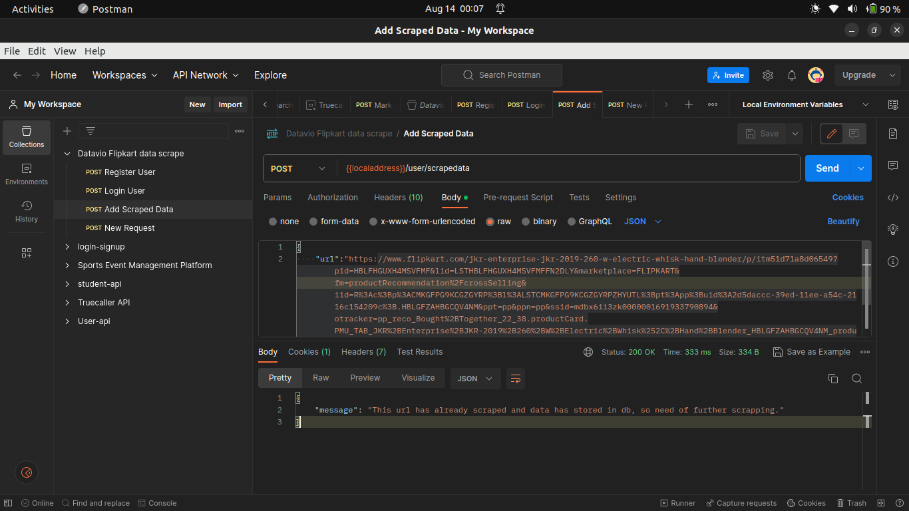
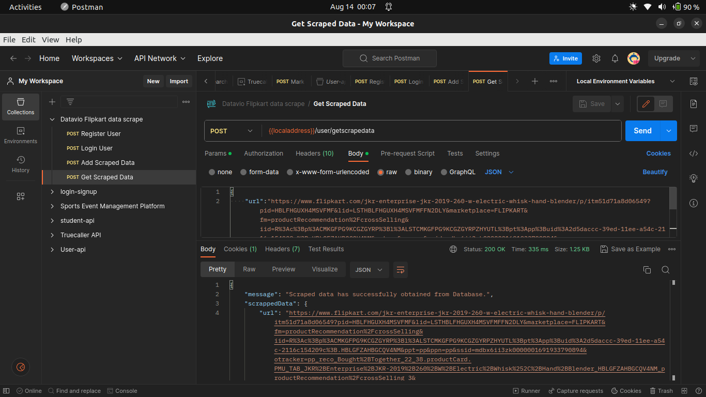
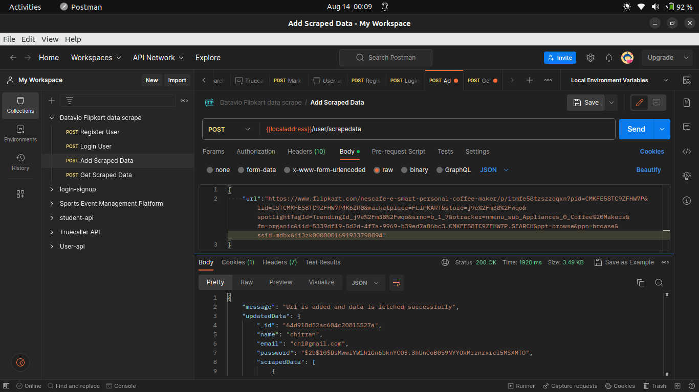
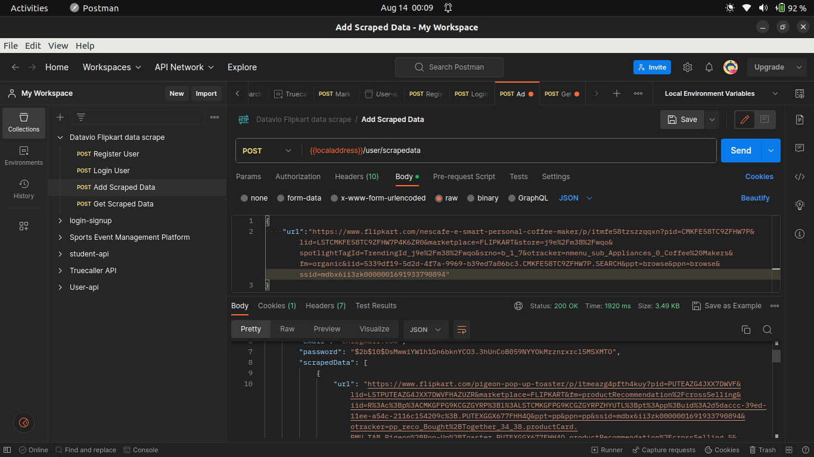
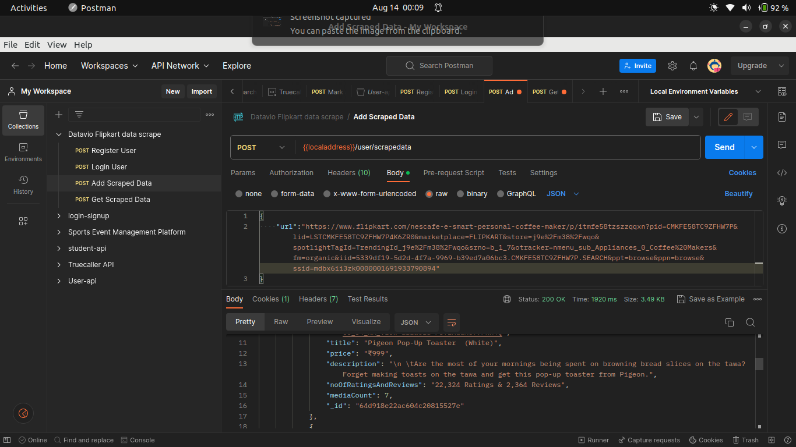
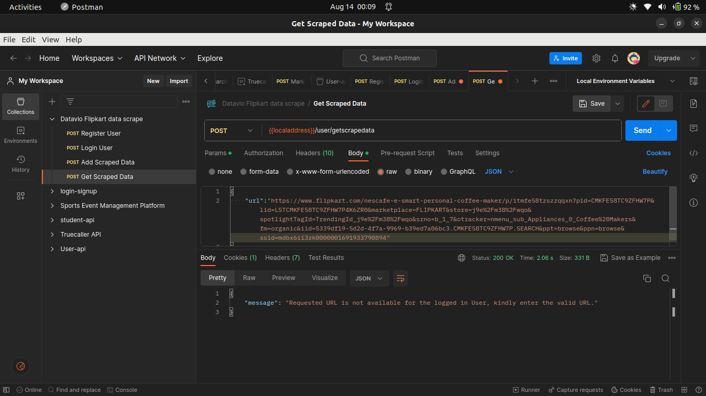
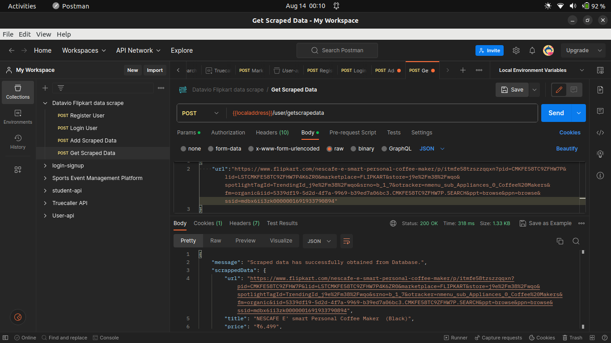
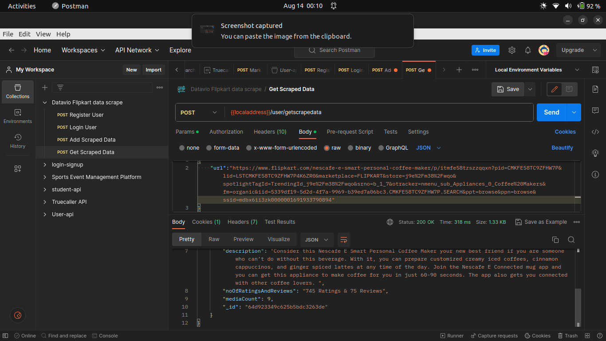

# Steps to run the code ⇒

1. `npm install` ⇒ to install all the dependency
2. `creation of .env file` -> create .env file, same as example.env file
3. `node index.js` ⇒ to run the code ( or nodemon index.js)

## APIs Endpoints:⇒

```
listOfAPIs:{
            "createAUser(post)": "user/register =>`to register a new user`",
            "login User(post)": "user/login =>`to login a user`",
            "scrape flipkart data(post)": "user/scrapedata =>`to scrape the data and store it into DB`",
            "get scraped data(post)": "user/scrapedata =>`to get the already stored scraped data from DB`"
}
```

## Deployed Link:-

```
https://crs-flipkart-scaping.onrender.com
```

## Screenshot of the project:-












