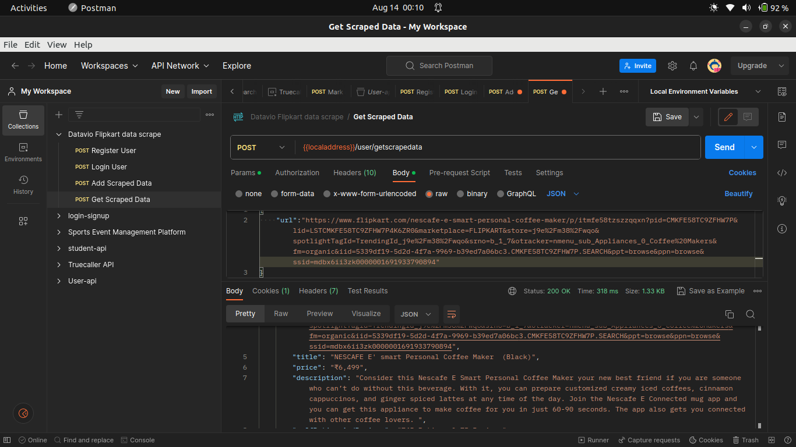

# Project Description:

1. An API that lets users signup and log in through JWT based authentication using email and password.
2. It has a post api that takes a Flipkart url as payload, scrapes the below-given fields, and saves them in Database with proper schema with user info.
3. This will work only if a user is logged in, else proper error message would be shown.
4. If the URL corresponding to the logged-in user is already present in the DB, and it will return from the DB. If the URL is not present or does not belong to a logged-in user, it will  show a proper error message.


## Fields scraped.
- Title
- price
- Description if it is present
- Number of reviews and ratings
- Ratings
- The number of media counts present in the product display box.

## Steps to run the code ⇒

1. `npm install` ⇒ to install all the dependency
2. `creation of .env file` -> create .env file, same as example.env file
3. `node index.js` ⇒ to run the code ( or nodemon index.js)

## APIs Endpoints:⇒

```
listOfAPIs:{
            "createAUser(post)": "user/register =>`to register a new user`",
            "login User(post)": "user/login =>`to login a user`",
            "scrape flipkart data(post)": "user/scrapedata =>`to scrape the data and store it into DB`",
            "get scraped data(post)": "user/scrapedata =>`to get the already stored scraped data from DB`"
}
```

## Deployed Link:-

```
https://crs-flipkart-scaping.onrender.com
```

## Screenshot of the project:-




